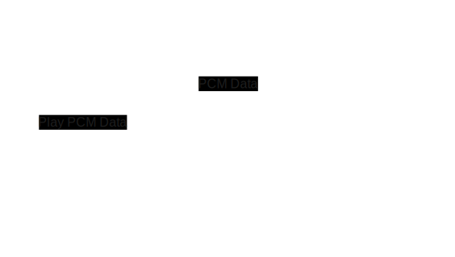

+++
date = '2025-05-13T19:27:56+02:00'
title = 'Chordel'
+++

Chordel is a standalone synthesizer that is played using the Ableton Push 2.  

*Last Updated: March 27th, 2025.*

<video src="chordel_mvp.mp4" controls></video>

## Overview

I won't be going into much detail about aspects that are covered in depth in the Ableton Push 2 MIDI and Display Interface Manual. However, I will be talking about my overall approach, how the program produces sounds, and by far the most challenging aspect: how to display an image on the Push 2 display.

The program itself runs on the computer and communicates with the Ableton Push 2 over USB. To summarize, here's what it does:

1. **Receive pressed pads:** Continuously read MIDI messages sent by the Push when pads are pressed.
2. **Update pad colors:** This is done by sending MIDI messages to the Push.
3. **Play sounds:** Synthesize sounds using TinySoundFont, a single-header synthesizer for SoundFonts.
4. **Update Push screen:** Composite an image using Cairo, convert it to the Push screen format, and transmit it via USB.

## Interesting Bits

I'm omitting details about points 1 and 2 – but TL;DR is: I'm using [PortMIDI](https://github.com/PortMidi/portmidi) for the bi-directional MIDI communication with the Push through its "User Port".

### How to Play Sounds

The application I’ve built is a standalone synthesizer, not a VST plugin. Unlike setups where MIDI events are sent to an external synthesizer to generate sound, this application handles sound generation directly. It uses [SoundFonts](https://en.wikipedia.org/wiki/SoundFont) to produce audio, with the core synthesis work handled by the [TinySoundFont](https://github.com/schellingb/TinySoundFont) library by [Bernhard Schelling](https://mastodon.gamedev.place/@schelling). For playback of the resulting PCM data, I rely on [SDL](https://github.com/libsdl-org/SDL/tree/SDL2), which is also used for the application’s window rendering, input handling, and other system-level functionality.

This aspect of the application has been surprisingly straightforward:

1. Find a nice SoundFont: I used [musical-artifacts.com](https://musical-artifacts.com/artifacts?tags=soundfont) to find fonts I like.
2. Tell TinySoundFont which SoundFont to use.
3. Tell it which MIDI note to play.
4. Write a callback that uses the retrieved PCM data and SDL to play the audio through the computer's audio device.

You can check out [this example code](https://github.com/schellingb/TinySoundFont/blob/main/examples/example1.c) from the [TinySoundFont GitHub repository](https://github.com/schellingb/TinySoundFont/tree/main) if you’re interested in the code. I basically did the same thing.

This has been simple to do because TinySoundFont is just a single file. No dependencies, it just works.

### Displaying an Image on the Push Screen

The goal of this application is to help me learn and discover chords using the Push.  
*I just want to play* and have the Push tell me what I’m playing — it acts as an assistant. Since I was aiming to _break away from the computer screen_, it was important to display the chord information directly on the Push’s screen. While the software still runs on a computer, I don’t need to look at it — I can just close the lid and play.

Okay, on to the technical part: The most important thing to understand is that the Push doesn’t offer a drawing API. Its display behaves like a standard screen expecting raw pixel data in [a specific format](https://github.com/Ableton/push-interface/blob/main/doc/AbletonPush2MIDIDisplayInterface.asc#display-interface), and all communication happens over USB. The display runs at 60 FPS, so updates need to be sent quickly. My implementation is very loosely based on [this example provided by Ableton](https://github.com/Ableton/push2-display-with-juce), but my code is written in plain C rather than C++, and I’m also not using JUCE.

This is how it works:

1. Composite an image using [Cairo](https://www.cairographics.org/). This creates an image like the one up top, in RGB24 format.
2. Transform the pixel data into a form that the Push screen expects. This is [explained in detail here](https://github.com/Ableton/push-interface/blob/main/doc/AbletonPush2MIDIDisplayInterface.asc#324-xoring-pixel-data).
3. Send the pixel data to the Push screen via USB. This turned out to be by far the hardest part for me, as I hadn’t worked with USB communication before. I’m using the [async API of libusb](https://libusb.sourceforge.io/api-1.0/libusb_io.html) to send pixel data as quickly as possible.

## Wrap up

The code is still in a prototype state, and for now, I’m not planning to open source it. That said, if there’s interest, I’d definitely consider it. This was also my first real application written in C, and along the way I learned a lot — especially about memory management, memory leaks (naturally), and how to track them down and fix them. Talking about this is due another time though.

If there are questions about anything I’ve mentioned here but didn’t cover in detail, feel free to reach out on [Bluesky](https://bsky.app/profile/tapir2342.bsky.social) or [Mastodon](https://mastodon.gamedev.place/@tapir).
